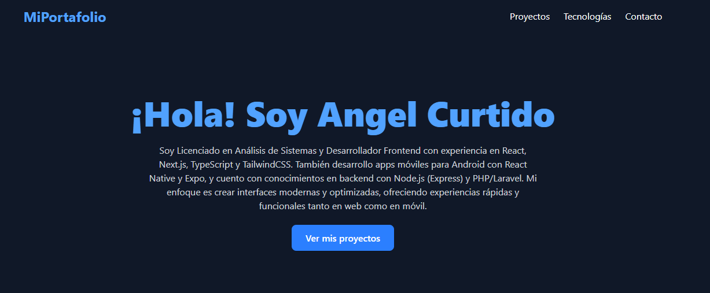
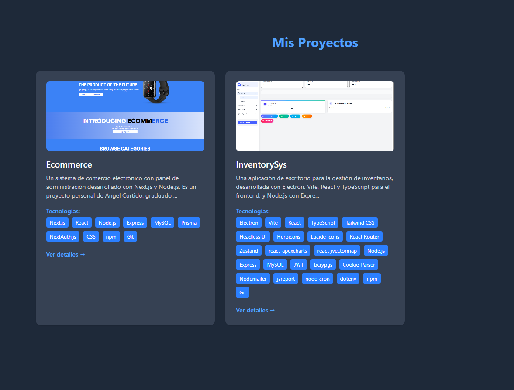
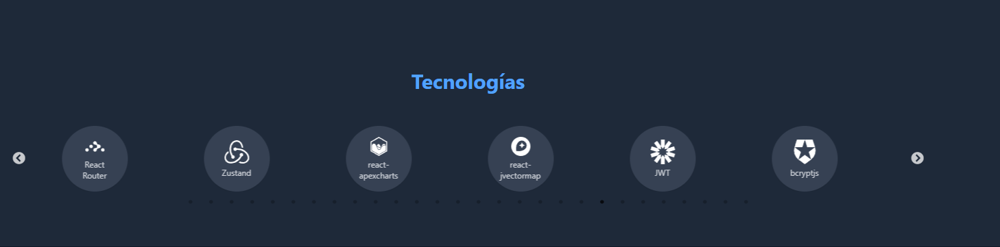
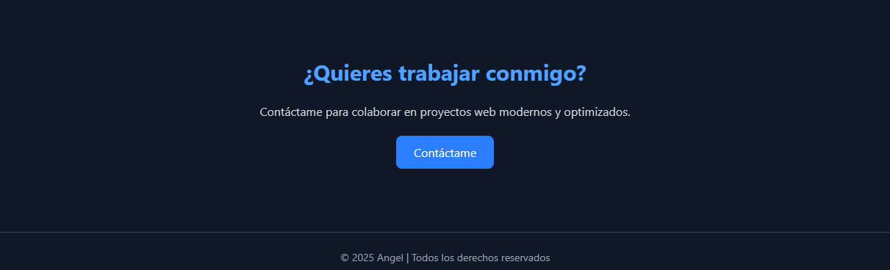

# Personal Portfolio

Welcome to the repository of my personal portfolio, a modern web application showcasing my projects, skills, and experience as a full-stack developer. This project is built with **Vite**, **React**, **TypeScript**, and uses **React Slick** for a dynamic technology carousel. The interface is responsive, optimized, and styled with **Tailwind CSS** for a visually appealing experience.

## Features

- **Projects Section**: Displays featured projects with descriptions, images, GitHub links, and lists of technologies used.
- **Technology Carousel**: An interactive carousel built with React Slick, showcasing the technologies I specialize in with circular, responsive icons.
- **Responsive Design**: Optimized for mobile, tablet, and desktop devices.
- **Intuitive Navigation**: Includes a navigation bar with links to Projects, Technologies, and Contact sections.
- **Modern Styling**: Utilizes Tailwind CSS for a clean and contemporary design.

## Technologies Used

- **Frontend**:
  - Vite
  - React
  - TypeScript
  - Tailwind CSS
  - React Slick (for the carousel)
  - React Icons (for technology icons)
- **Tools**:
  - npm
  - Git
  - ESLint (for linting)
  - Prettier (for code formatting)

## Installation

Follow these steps to run the project locally:

1. **Clone the repository**:
   ```bash
   git clone https://github.com/angeljrcurtido2/portfolio.git
   cd portfolio
   ```

2. **Install dependencies**:
   Ensure you have Node.js installed. Then, run:
   ```bash
   npm install
   ```

3. **Start the development server**:
   ```bash
   npm run dev
   ```
   This will start the application at `http://localhost:5173` (or the port configured by Vite).

4. **Build for production** (optional):
   ```bash
   npm run build
   ```
   The generated files will be in the `dist` folder.

## Usage

- Navigate through sections using the navigation bar at the top.
- Explore projects in the "My Projects" section, which includes descriptions, links, and technologies used.
- View technologies in the "Technologies" section, displayed in an interactive, responsive carousel.
- Use the contact link to send me an email.

## Project Structure

```
portfolio/
├── src/
│   ├── assets/                # Images and static resources
│   ├── styles/                # Custom CSS files (e.g., carousel.css)
│   ├── App.tsx                # Main component
│   ├── index.css              # Global styles
│   └── main.tsx               # Entry point
├── public/                    # Public assets
├── package.json               # Dependencies and scripts
├── vite.config.ts             # Vite configuration
├── tsconfig.json              # TypeScript configuration
├── .eslintrc.json             # ESLint configuration
├── .prettierrc                # Prettier configuration
└── README.md                  # This file
```

## Featured Projects

1. **Ecommerce**:
   - An e-commerce system with an admin panel.
   - Technologies: Next.js, React, Node.js, Express, MySQL, Prisma, NextAuth.js, CSS, npm, Git.
   - [View on GitHub](https://github.com/angeljrcurtido2/ecommerce)

2. **InventorySys**:
   - A desktop application for inventory management.
   - Technologies: Electron, Vite, React, TypeScript, Tailwind CSS, Headless UI, Heroicons, Lucide Icons, React Router, Zustand, react-apexcharts, react-jvectormap, Node.js, Express, MySQL, JWT, bcryptjs, Cookie-Parser, Nodemailer, jsreport, node-cron, dotenv, npm, Git.
   - [View on GitHub](https://github.com/angeljrcurtido2/Project_Vite_React_TSX)

## Contributing

Contributions are welcome! If you have suggestions or improvements, please open an issue or submit a pull request.

## Contact

Feel free to reach out via email at [tuemail@correo.com](mailto:angeljrcurtido@gmail.com) for collaboration or inquiries.

## Project Screenshots 

**DESCRIPTION SECTION**


**PROJECTS SECTION**


**TECHNOLOGIES SECTION**


**FOOTER SECTION**
